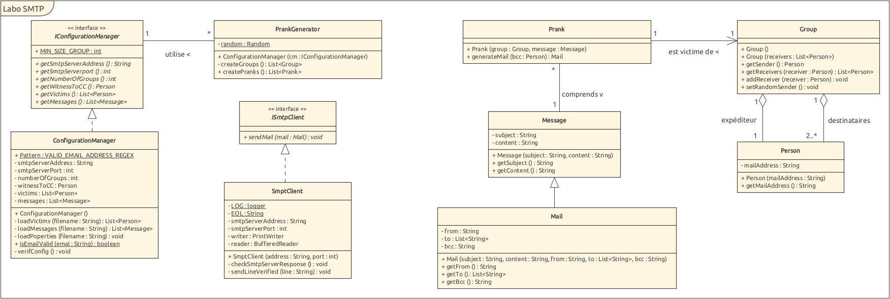

# Rapport Labo SMTP - API HEIG

Auteurs : Alexandre Jaquier, Valentin Kaelin

## Table des matières

- [Description](#description)
- [MockMock](#mockmock)
- [Installation](#installation)
  - [Besoins techniques](#besoins-techniques)
  - [Projet Java](#projet-java)
  - [Serveur SMTP](#serveur-smtp)
- [Configuration et exécution](#configuration-et-exécution)
- [Implémentation](#implémentation)
  - [Dialogues client - serveur SMTP](#dialogues-client---serveur-smtp)
  - [Exemples](#exemples)

## Description

Ce répertoire GitHub contient la réalisation du laboratoire numéro 4 du cours API de l'HEIG. Ce laboratoire a pour but de mettre en pratique l'utilisation du protocole SMTP. Ce projet permet de créer des campagnes de "pranks". L'utilisateur peut définir une liste d'e-mails de victimes ainsi que les messages de farce à envoyer. Par la suite, le programme s'occupera de créer des groupes et enverra aléatoirement un des messages à chaque groupe.

Il est également possible de tester l'envoi des e-mails sans embêter de vraies personnes en utilisant l'outil MockMock permettant de créer un serveur SMTP local. Une configuration docker est présente afin de faciliter son utilisation.

## MockMock

Afin de pouvoir tester l'application, il est possible de mettre en place un serveur SMTP local grâce à l'outil [MockMock](https://github.com/tweakers/MockMock).

MockMock est un outil permettant de "mock" / simuler un vrai serveur SMTP. Ce serveur aura pour but de récupérer tous les mails envoyés depuis votre machine et de les afficher de manière graphique grâce à une interface web. De cette façon, il est facile de tester l'application sans envoyer des e-mails à de vraies personnes.

## Installation

### Besoins techniques

La liste suivante doit être installée sur votre machine afin de pouvoir utiliser correctement ce projet:

- Java avec >= jdk11
- Maven
- Docker

### Projet Java

Le projet dans le dossier `code` est un projet Maven classique. Il est donc très simple de créer son exécutable et le lancer via les commandes suivantes (depuis le dossier `code`):

```bash
mvn clean package
cd target
java -jar LaboSMTP-1.0-SNAPSHOT.jar
```

### Serveur SMTP

L'exécutable de MockMock est déjà présent dans le dossier `docker`. Nous avons utilisé une [version modifiée](https://github.com/HEIGVD-Course-API/MockMock) du logiciel afin de régler des soucis présents dans la version officielle.

Afin de lancer le programme, il est nécessaire de lancer les scripts dans le dossier `docker`, dans cet ordre-ci:

```bash
./build-image.sh
./run-container.sh
```

Une fois ces commandes effectuées, un conteneur docker contenant l'application MockMock tournera en fond sur votre ordinateur. Celle-ci contient deux points d'entrées:

- Un serveur SMTP sur le port 25
- L'interface web sur le port 8282

Il vous est donc possible d'accéder à l'interface en vous rendant sur la page suivante sur un navigateur: [localhost:8282](http://localhost:8282/). Elle devrait être vide pour le moment. Rendez-vous dans la section suivante afin d'apprendre à réaliser une campagne de pranks.

## Configuration et exécution

Après avoir exécuté la commande `mvn clean package`, il vous est possible de configurer votre campagne de pranks grâce aux fichiers se trouvant dans le dossier `target/config`. Voici le but de ces 3 fichiers:

- **config.properties**: fichier de configuration principal, il vous est possible de changer l'adresse et le port du serveur SMTP (à laisser par défaut si vous utilisez MockMock), le nombre de groupes et l'adresse qui sera en copie câchée de chaque mail afin de surveiller que la campagne s'est bien déroulée.
- **messages.utf8**: fichier contenant les différents messages de pranks, il vous est possible d'en ajouter autant que vous le souhaitez. La syntaxe des messages est la suivante, les textes entre crochets sont à remplacer par votre contenu:

```java
Subject: [SUJET ICI]

[CONTENU DU MAIL ICI
SUITE DU CONTENU
ETC]
== // Séparation des messages
Subject: [SUJET ICI]
... // etc etc
```

- **victims.utf8**: fichier contenant la liste des victimes à cibler, chaque ligne doit contenir une adresse e-mail valide. À noter que la taille de chaque groupe doit être de 3 au minimum. Il faut donc avoir un nombre de victimes suffisant comparé au nombre de groupes défini dans le fichier `config.properties`.

Après avoir fini votre configuration, il est possible d'exécuter l'application en se rendant dans le dossier `target` et en lançant la commande suivante:

```bash
java -jar LaboSMTP-1.0-SNAPSHOT.jar
```

Un affichage vous expliquant le déroulé du programme sera affiché dans la console et il vous sera possible d'aller vérifier le bon envoi des mails en retournant sur l'interface de MockMock sur le site [localhost:8282](http://localhost:8282/).

## Implémentation



**Remarques générales**  
Nous nous sommes avant tout basé sur l'implémentation exposée dans la vidéo de présentation du laboratoire afin d'avoir une architecture bien définie. Cela nous a permis de nous familiariser avec la notion d'interface, que nous n'avions pas encore vraiment utilisée.

**Classe ConfigurationManager**  
S'occupe de charger les fichiers de configuration disponibles à l'utilisateur exécutant l'application. C'est également cette classe qui va vérifier l'intégrité des données de configuration entrées.

**Classe Personne**  
Une personne est pour le moment représentée uniquement via son adresse e-mail. Nous l'avons tout de même implémentée comme une classe dans un souci d'évolutivité.

**Classes Message et Mail**  
Un message contient uniquement un sujet et un contenu. Un véritable mail possède aussi des destinataires, un expéditeur et une copie cachée. Ce dernier est modélisé grâce à la classe Mail qui hérite de Message.

**Classe Groupe**
Modélise plusieurs destinatires ainsi qu'un expéditeur. Il est possible d'assigner un expéditeur aléatoirement parmi la liste des destinaires entrés.

**Classe PrankGenerator**  
S'occupe de toute la logique de création de groupes ainsi que d'assigner une prank à chaque groupe. La création est faite de manière aléatoire parmi toute la liste de victimes de la configuration.
**Classe Prank**  
La classe prank permet de générer l'e-mail final que le client va envoyer au serveur.

**Classe SmtpClient**
S'occupe de toute la connexion et de la communication avec le serveur SMTP. La classe vérifie notamment que le serveur retourne bien un code de succès après avoir reçu les différentes commandes du client.

### Dialogues client - serveur SMTP

Voici un diagramme présentant un exemple de communication entre le client (notre code Java et plus particulièrement notre classe SmtpClient) et le serveur SMTP (MockMock dans notre cas).


À chaque envoi du client, le serveur répondra avec le code 250 si tout se passe bien. La commande `RCPT TO` doit être réalisée pour chaque destinataire de l'e-mail ainsi que pour la personne qui recevra ledit mail en copie cachée.

Après avoir envoyé la commande DATA, le client reçoit du serveur la syntaxe à utiliser afin d'annoncer que l'envoi du contenu de son e-mail est terminé (un point entre deux retours à la ligne).

Une fois l'envoi de l'e-mail terminé, le client peut annoncer au serveur qu'il souhaite quitter la communication via la commande QUIT et le serveur ferme la connexion.

### Exemples

Les screenshots suivant montrent l'ordre des différentes étapes à réaliser afin de réussir à envoyer sa campagne de pranks.

Build du conteneur docker, le premier peut prendre un peu de temps:


Lancement du conteneur docker et affichage de ses logs:


Build de l'application Java de création de pranks avec Maven:


Lancement de l'application, les e-mails sont envoyés:


Vérification que le serveur SMTP a bien reçu les e-mails dans ses logs:


Affichage des e-mails reçus par le serveur SMTP sur l'interface web:


Par la suite, il est possible de changer le champ `smtpServerAddress` du fichier de configuration `config.properties` par l'adresse d'un vrai serveur SMTP (ex: celui de l'école), afin d'envoyer véritablement les e-mails.
